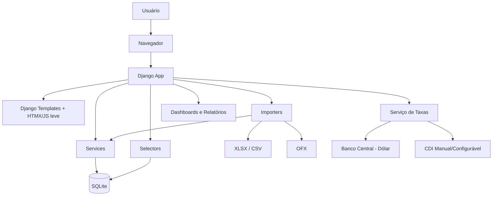
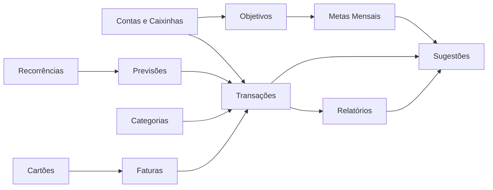
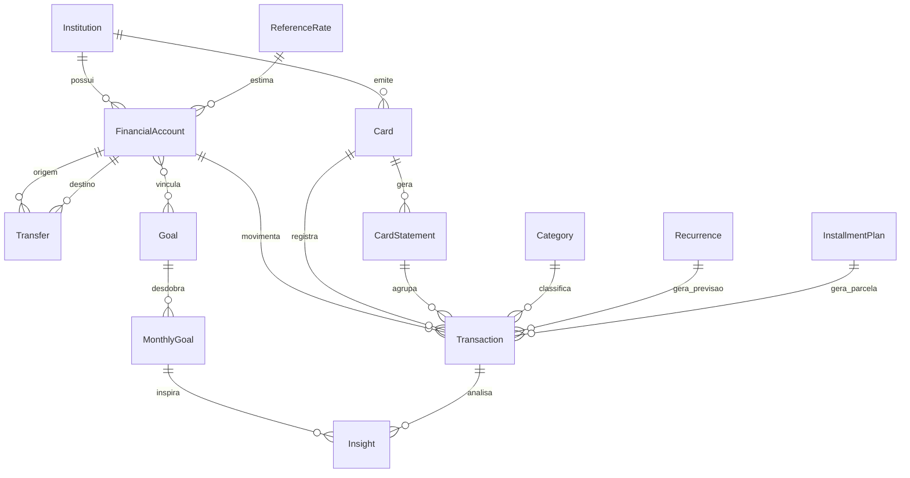
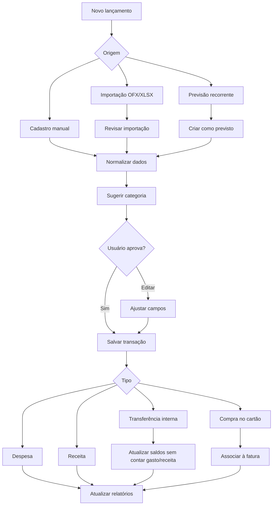
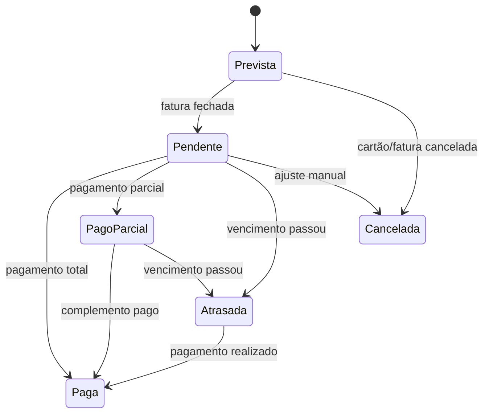
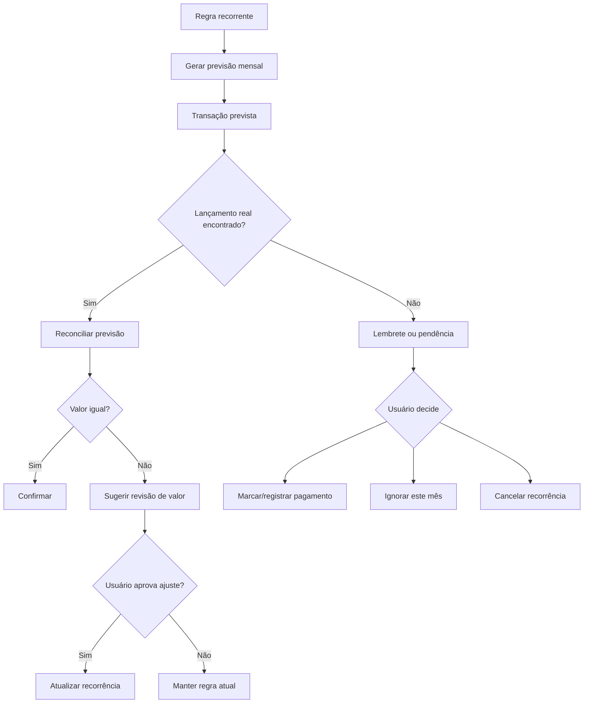
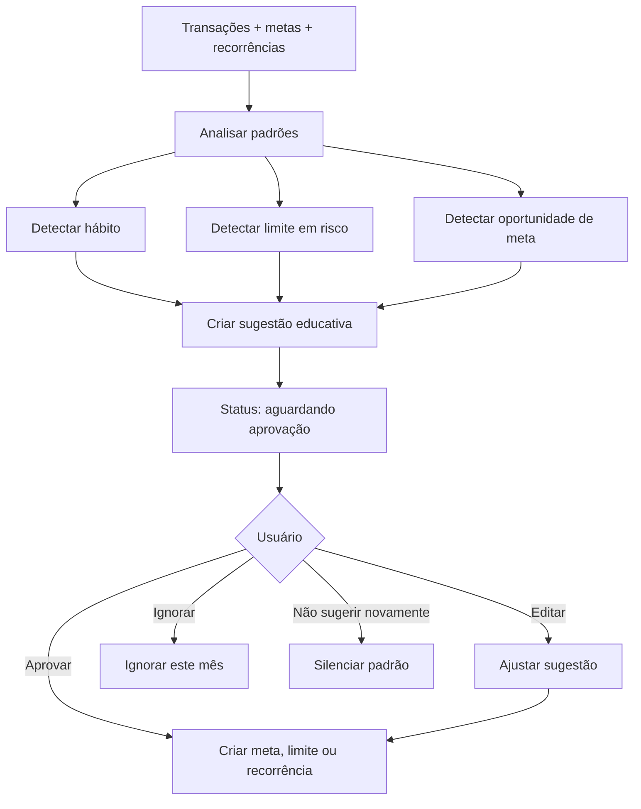
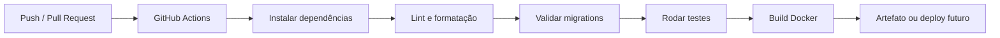

# **Aplicativo de Controle Financeiro Pessoal**

## **1. Objetivo**

Criar um aplicativo web local em Python, usando Django, para controle financeiro pessoal, com foco em organização visual, aprendizado financeiro e planejamento.

O app deve ajudar a entender gastos, controlar contas, caixinhas, cartões, faturas, recorrências, objetivos e metas mensais. Também deve sugerir ações de forma educativa e tranquila, sempre pedindo aprovação antes de criar limites, metas ou aplicar mudanças automáticas.

## **2. Perfil do Projeto**

| **Item** | **Decisão** |
| --- | --- |
| Linguagem principal | Python |
| Framework | Django |
| Banco inicial | SQLite |
| Interface | Django templates com interatividade leve |
| Dashboards | Páginas Django com gráficos, inicialmente Chart.js |
| Execução local | Docker / Docker Compose |
| CI/CD | GitHub Actions |
| Importações | XLSX/CSV para testes e OFX como fonte importante |
| APIs externas | Dólar via Banco Central; CDI manual/configurável no MVP |

## **3. Escopo Principal**

### **3.1 Cadastros**

O app terá cadastro de:

- Instituições financeiras.
- Contas correntes.
- Caixinhas, porquinhos e poupanças.
- Conta global em dólar.
- Cartões de crédito.
- Cartões de benefício, como Caju VR/VA, transporte e Bilhete Único.
- Categorias e subcategorias.
- Objetivos e metas mensais.
- Recorrências.

### **3.2 Contas, Caixinhas e Saldos**

Contas e caixinhas representam lugares onde existe saldo.

Exemplos:

- Inter - Conta corrente.
- Inter - Porquinho reserva automática.
- Inter - Poupança.
- Inter - Conta global em dólar.
- Dinheiro físico.
- Caju VR.
- Bilhete Único.

Cada conta pode ter:

| **Campo** | **Descrição** |
| --- | --- |
| Nome | Nome amigável da conta |
| Instituição | Banco, carteira ou emissor |
| Tipo | Corrente, poupança, porquinho, benefício, global, dinheiro, investimento |
| Moeda | BRL, USD ou outra |
| Saldo atual | Saldo conhecido ou estimado |
| Rendimento | Nenhum, manual, % CDI, fixo mensal, outro |
| Liquidez | Imediata, D+1, D+30 ou personalizada |
| Objetivo vinculado | Opcional |

### **3.3 Transferências Internas**

Transferências entre contas não contam como gasto nem como receita.

Exemplo:

| **Origem** | **Destino** | **Valor** | **Efeito** |
| --- | --- | --- | --- |
| Inter Conta Corrente | Porquinho Reserva | R$ 300 | Reduz uma conta e aumenta outra |

Essa movimentação altera o patrimônio, mas não deve entrar em relatórios de despesa.

### **3.4 Cartões**

O app deve suportar dois grandes tipos de cartão.

| **Tipo** | **Exemplo** | **Regra principal** |
| --- | --- | --- |
| Crédito | Nubank, Inter | Tem limite, fechamento, vencimento e fatura |
| Benefício / saldo | Caju, Bilhete Único | Tem saldo, recarga e estimativa de consumo |

Cartões de crédito terão:

- Limite.
- Dia de fechamento.
- Dia de vencimento.
- Conta padrão de pagamento.
- Faturas mensais.
- Status de pagamento.
- Lembretes de vencimento.

Cartões de benefício terão:

- Saldo estimado.
- Recargas.
- Consumo por categoria.
- Previsão de duração do saldo.
- Alertas de saldo baixo.

### **3.5 Faturas**

Faturas serão entidades próprias.

Campos principais:

| **Campo** | **Descrição** |
| --- | --- |
| Cartão | Cartão relacionado |
| Mês de referência | Mês financeiro da fatura |
| Data de fechamento | Quando a fatura fecha |
| Data de vencimento | Quando deve ser paga |
| Valor previsto | Soma estimada antes do fechamento |
| Valor fechado | Valor final após fechamento |
| Valor pago | Valor já quitado |
| Status | Prevista, pendente, paga parcial, paga, atrasada, cancelada |
| Conta de pagamento | Conta de onde sairá o dinheiro |

O pagamento de fatura deve reduzir o saldo da conta de pagamento, mas não deve duplicar as despesas por categoria.

### **3.6 Status de Pagamento**

Não será usada apenas uma flag simples de “pago”.

Status recomendados:

| **Status** | **Uso** |
| --- | --- |
| previsto | Algo esperado, ainda não confirmado |
| pendente | Confirmado, mas ainda não pago |
| pago | Quitado |
| pago_parcial | Parte do valor foi paga |
| atrasado | Venceu e não foi pago |
| cancelado | Não deve mais ser considerado |
| ignorado | Ignorado apenas naquele ciclo ou mês |

### **3.7 Recorrências**

Recorrências geram previsão, nunca pagamento automático.

Exemplos:

- Streaming.
- Academia.
- Internet.
- Celular.
- Assinaturas.
- Contas fixas.
- Hábitos aprovados pelo usuário.

Campos principais:

| **Campo** | **Descrição** |
| --- | --- |
| Nome | Ex: Spotify |
| Tipo | Assinatura, conta fixa, renda, hábito, outro |
| Frequência | Mensal, semanal, anual, personalizada |
| Valor previsto | Valor esperado |
| Conta ou cartão esperado | Onde geralmente aparece |
| Dia previsto | Dia provável da cobrança |
| Criar previsão | Sim |
| Marcar pago automaticamente | Não |
| Precisa confirmação | Sim por padrão |

Quando o lançamento real aparecer, o app pode reconciliar a previsão com a transação importada ou cadastrada manualmente.

### **3.8 Parcelamentos**

Parcelamentos são diferentes de recorrências.

Um parcelamento é uma compra única dividida em várias partes.

Exemplo:

| **Campo** | **Valor** |
| --- | --- |
| Compra | Notebook |
| Total de parcelas | 10 |
| Parcela atual | 6 |
| Valor da parcela | R$ 320 |
| Cartão | Nubank |
| Data final prevista | Setembro |

### **3.9 Objetivos e Metas**

Objetivos serão entidades próprias e poderão ter vínculo opcional com uma ou mais contas/caixinhas.

Tipos:

| **Tipo** | **Exemplo** |
| --- | --- |
| Acúmulo | Juntar R$ 15.000 para reserva |
| Redução | Gastar no máximo R$ 600 em alimentação |

Objetivos podem gerar metas mensais.

Exemplos:

- Aportar R$ 400 na viagem.
- Manter pós-futebol abaixo de R$ 180.
- Reduzir delivery para R$ 250.
- Manter alimentação abaixo de R$ 800.

O progresso de um objetivo pode vir:

- Do saldo de uma conta vinculada.
- Da soma de várias contas vinculadas.
- De lançamentos manuais.
- Da redução de gastos em uma categoria.

### **3.10 Sugestões Automáticas**

As sugestões devem ter tom educativo e tranquilo.

O app pode sugerir:

- Limites de categoria.
- Metas mensais.
- Criação de uma recorrência.
- Ajuste de orçamento.
- Identificação de hábitos.
- Redução leve de gastos.
- Aporte em objetivo.

As sugestões nunca devem aplicar mudanças sem aprovação.

Exemplo:

> *Percebi um hábito recorrente: gastos às quintas após o futebol. Média: R$ 40 por evento. Isso deve representar cerca de R$ 160 a R$ 200 neste mês. Sugestão: criar um limite de R$ 180 para "pós-futebol". Quer aprovar?*
> 

Ações possíveis:

- Aprovar.
- Editar valor.
- Ignorar este mês.
- Não sugerir novamente.

### **3.11 Dashboards e Relatórios**

Dashboards iniciais:

- Painel mensal.
- Gastos por categoria.
- Cartões e faturas.
- Contas, caixinhas e patrimônio.
- Objetivos e metas.
- Recorrências previstas vs. confirmadas.
- Sugestões e hábitos detectados.

Relatórios futuros:

- Exportação CSV.
- Exportação PDF.
- Evolução patrimonial.
- Comparativo mês a mês.
- Gastos por cartão.
- Gastos por categoria.
- Previsão de fluxo de caixa.

## **4. Arquitetura**

### **4.1 Decisão Arquitetural**

Usaremos um monólito modular em Django.

Isso mantém o projeto simples de rodar e aprender, mas com separação clara de domínios.

### **4.2 Apps Django Propostos**

| **App** | **Responsabilidade** |
| --- | --- |
| core | Base comum, utilitários e tipos compartilhados |
| institutions | Bancos, emissores e instituições |
| accounts | Contas, caixinhas, saldos e transferências |
| cards | Cartões, faturas, limites e vencimentos |
| categories | Categorias e subcategorias |
| transactions | Transações, status e lançamentos |
| recurrences | Recorrências e previsões |
| goals | Objetivos e metas mensais |
| imports | Importação XLSX, CSV e OFX |
| insights | Sugestões automáticas e hábitos detectados |
| reports | Dashboards, consultas e relatórios |

### **4.3 Camadas Internas**

O projeto deve evitar regras de negócio complexas diretamente em views.

Padrão recomendado:

| **Camada** | **Função** |
| --- | --- |
| Models | Estrutura dos dados e relações |
| Forms | Validação de entrada da interface |
| Views | Orquestração da requisição e resposta |
| Services | Regras de negócio e ações |
| Selectors | Consultas reutilizáveis para telas e relatórios |
| Importers | Leitura de arquivos externos |
| Management Commands | Rotinas executadas por comando |
| Tests | Verificação das regras principais |

Fluxo recomendado:

`View -> Form -> Service -> Model
Dashboard -> Selector -> Model
Arquivo -> Importer -> Service -> Model`

## **5. Princípios de Desenvolvimento**

### **5.1 DRY**

Evitar repetição, mas sem criar abstrações cedo demais.

### **5.2 Clean Code**

- Nomes claros.
- Funções pequenas.
- Responsabilidades explícitas.
- Código fácil de ler antes de ser “esperto”.

### **5.3 SOLID com moderação**

Usar SOLID como guia, principalmente para separar responsabilidades.

### **5.4 Testes desde cedo**

Testar principalmente:

- Transferências internas.
- Pagamento de faturas.
- Geração de recorrências.
- Parcelamentos.
- Cálculo de metas.
- Importações.
- Sugestões automáticas.

### **5.5 Evolução incremental**

Cada fase deve entregar algo usável.

## **6. Modelagem Inicial do Banco**

### **6.1 Entidades Principais**

| **Entidade** | **Descrição** |
| --- | --- |
| Institution | Banco, emissor ou instituição |
| FinancialAccount | Conta, caixinha, porquinho ou cartão benefício |
| Card | Cartão de crédito ou benefício |
| CardStatement | Fatura do cartão |
| Category | Categoria de receita/despesa |
| Transaction | Lançamento financeiro |
| Transfer | Transferência entre contas |
| InstallmentPlan | Compra parcelada |
| Recurrence | Regra recorrente |
| Goal | Objetivo de acúmulo ou redução |
| MonthlyGoal | Meta mensal derivada ou manual |
| Insight | Sugestão automática |
| ReferenceRate | Taxas como dólar e CDI |

### **6.2 Observação Sobre SQLite**

SQLite é suficiente para a primeira versão.

O “banco do Django” será o SQLite inicialmente, gerenciado pelas migrations do próprio Django.

Se no futuro o app for hospedado ou multiusuário, será possível migrar para PostgreSQL.

## **7. Integrações e Importações**

### **7.1 Planilha Atual**

A planilha atual será usada como:

- Base de teste.
- Referência de categorias.
- Insumo para validar importação.
- Exemplo para treinar categorização.

Ela não será a fonte oficial permanente.

### **7.2 OFX**

OFX será uma fonte importante para importar extratos de bancos e cartões.

O importador deve:

- Ler transações.
- Evitar duplicidades.
- Sugerir categorias.
- Permitir revisão antes de confirmar.
- Associar transações a contas ou cartões.

### **7.3 APIs Externas**

| **Dado** | **Estratégia** |
| --- | --- |
| Dólar | API do Banco Central |
| CDI | Manual/configurável no MVP |
| CDI automático | Evolução futura |

As taxas devem ser salvas em histórico local.

Se a API falhar, o app usa o último valor salvo e mostra aviso de desatualização.

## **8. Lembretes**

O app deve gerar lembretes para:

- Faturas próximas do vencimento.
- Faturas vencidas e pendentes.
- Contas recorrentes ainda não confirmadas.
- Metas mensais em risco.
- Saldo baixo em cartão benefício.

Configurações iniciais recomendadas:

- 7 dias antes.
- 3 dias antes.
- No dia do vencimento.
- Após vencimento, se ainda estiver pendente.

## **9. Roadmap**

### **Fase 1 - Fundação do Projeto**

- Criar projeto Django.
- Configurar Docker e Docker Compose.
- Configurar SQLite.
- Configurar GitHub Actions.
- Criar estrutura modular de apps.
- Criar testes básicos.

### **Fase 2 - Cadastros Fundamentais**

- Instituições.
- Contas e caixinhas.
- Cartões.
- Categorias.
- Admin Django para cadastros.

### **Fase 3 - Transações e Transferências**

- Receitas.
- Despesas.
- Transferências internas.
- Status de pagamento.
- Ajustes de saldo.

### **Fase 4 - Cartões e Faturas**

- Limites.
- Fechamento.
- Vencimento.
- Conta padrão de pagamento.
- Geração de faturas.
- Pagamento total/parcial.
- Lembretes.

### **Fase 5 - Recorrências e Previsões**

- Cadastro de recorrências.
- Geração de previsões mensais.
- Reconciliar previsão com lançamento real.
- Evitar pagamento automático.

### **Fase 6 - Objetivos e Metas Mensais**

- Objetivos de acúmulo.
- Objetivos de redução.
- Vínculo com contas.
- Metas mensais.
- Progresso automático.

### **Fase 7 - Dashboards**

- Painel mensal.
- Gastos por categoria.
- Contas e patrimônio.
- Cartões e faturas.
- Objetivos.
- Recorrências.

### **Fase 8 - Importações**

- Importação XLSX/CSV para testes.
- Importação OFX.
- Revisão antes de confirmar.
- Categorização assistida.

### **Fase 9 - Insights e Sugestões**

- Detectar gastos recorrentes.
- Sugerir limites.
- Sugerir metas mensais.
- Sugerir recorrências.
- Exigir aprovação do usuário.

### **Fase 10 - Evoluções**

- Dólar via Banco Central.
- CDI automático, se houver fonte adequada.
- Relatórios exportáveis.
- Deploy opcional.
- Melhorias visuais.

## **10. Diagramas**

### **10.1 Arquitetura Geral**

### **10.2 Domínios do Sistema**

Contas

### **10.3 Modelo de Dados Inicial**

### **10.4 Fluxo de Lançamento e Classificação**

### **10.5 Fluxo de Fatura**

### **10.6 Fluxo de Recorrências**

### **10.7 Fluxo de Sugestões Automáticas**

### **10.8 Pipeline de CI/CD**

## **11. Decisões Iniciais**

| **Tema** | **Decisão inicial** |
| --- | --- |
| Frontend | Django templates com interatividade leve; HTMX pode ser adotado quando uma tela realmente precisar |
| Biblioteca de gráficos | Chart.js inicialmente |
| Estilo visual | Usar o mockup atual como referência inicial |
| Autenticação | Usuário único local no MVP |
| Deploy | Evolução futura; CI entra desde a fundação |
| CDI automático | Fase futura, após escolher fonte confiável |
| Banco | SQLite no MVP, com possibilidade futura de PostgreSQL |
| Testes | Pytest ou Django TestCase; escolher na fase de fundação |

## **12. Critérios de Sucesso**

O projeto será considerado bem encaminhado quando:

- O usuário conseguir cadastrar contas, caixinhas e cartões.
- Transferências internas não forem tratadas como despesa/receita.
- Cartões gerarem faturas com vencimento e conta de pagamento.
- Recorrências gerarem previsões sem marcar como pago.
- Objetivos puderem acompanhar acúmulo e redução de gastos.
- Dashboards ajudarem a entender o mês financeiro.
- Importações puderem ser revisadas antes de confirmar.
- Sugestões automáticas forem úteis, tranquilas e aprováveis.
- O projeto tiver Docker, testes e GitHub Actions desde cedo.

## **13. Próximo Passo**

Após aprovação desta especificação, o próximo passo é criar um plano de implementação faseado.

Esse plano deve listar:

- Ordem dos commits.
- Apps Django a criar primeiro.
- Models iniciais.
- Testes por fase.
- Telas mínimas.
- Comandos de importação.
- Critérios para considerar cada fase pronta.